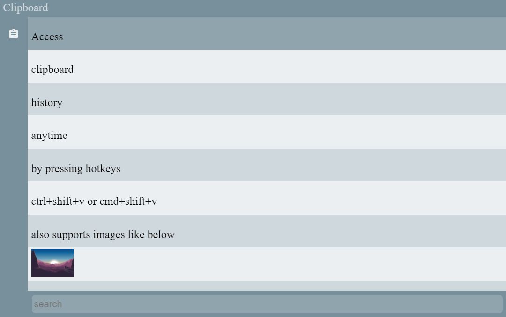

# Ditto++

Cross platform clipboard manager inspired by Ditto for windows

## How to use

- The application lives in system tray
- press ctrl+shift+v or cmd+shift+v to hide or show it and press escape to hide it
- use arrow keys or mouse to select the clip item from the history that you want to use
- press enter or click to copy the currently selected item on clipboard
- to search through the clipboard history simply start typing the search query

### Search highlight

### Download

Find your download: [https://github.com/RubinderS/DittoPlusPlus/releases/](https://github.com/RubinderS/DittoPlusPlus/releases/)
